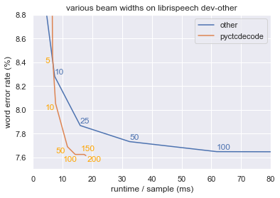
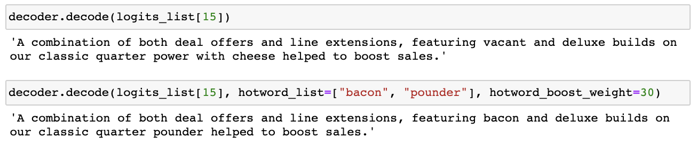
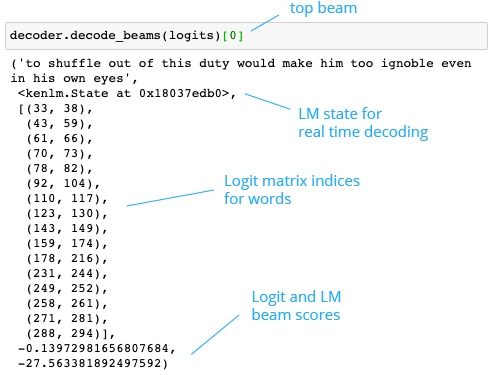

  <a href="https://github.com/kensho-technologies/pyctcdecode/actions?query=workflow%3A%22Tests+and+lint%22"></a>
  <a href="https://codecov.io/gh/kensho-technologies/pyctcdecode"></a>
  <a href="https://opensource.org/licenses/Apache-2.0"></a>
  <a href="http://www.repostatus.org/#active"></a>
  <a href="https://github.com/psf/black"></a>

## pyctcdecode

A fast and feature-rich CTC beam search decoder for speech recognition written in Python, providing n-gram (kenlm) language model support similar to PaddlePaddle's decoder, but incorporating many new features such as byte pair encoding and real-time decoding to support models like Nvidia's [Conformer-CTC](tutorials/01_pipeline_nemo.ipynb) or Facebook's [Wav2Vec2](tutorials/02_pipeline_huggingface.ipynb).

``` bash
pip install pyctcdecode
```

### Main Features:

- 🔥 hotword boosting
- 🤖 handling of BPE vocabulary
- 👥 multi-LM support for 2+ models
- 🕒 stateful LM for real-time decoding
- ✨ native frame index annotation of words
- 💨 fast runtime, comparable to C++ implementation
- 🐍 easy-to-modify Python code

### Quick Start:

``` python
from pyctcdecode import build_ctcdecoder

# specify alphabet labels as they appear in logits
labels = [
    " ", "a", "b", "c", "d", "e", "f", "g", "h", "i", "j", "k", "l",
    "m", "n", "o", "p", "q", "r", "s", "t", "u", "v", "w", "x", "y", "z",
]

# prepare decoder and decode logits via shallow fusion
decoder = build_ctcdecoder(
    labels,
    kenlm_model_path="/my/dir/kenlm_model.arpa",  # either .arpa or .bin file
    alpha=0.5,  # tuned on a val set
    beta=1.0,  # tuned on a val set
)
text = decoder.decode(logits)
```

If the vocabulary is BPE-based, `pyctcdecode` will automatically recognize that and handled token merging automatically.

_(Note: the LM itself has no notion of this and is still word-based.)_

``` python
labels = ["<unk>", "▁bug", "s", "▁bunny"]

decoder = build_ctcdecoder(
    labels,
    kenlm_model_path,
)
text = decoder.decode(logits)
```

Improve domain specificity by adding important contextual words ("hotwords") during inference:

``` python
hotwords = ["looney tunes", "anthropomorphic"]
text = decoder.decode(
    logits,
    hotwords=hotwords,
    hotword_weight=10.0,
)
```

_(Note: `pyctcdecode` contains several free hyperparameters
that can strongly influence error rate and wall time.  Default values
for these parameters were (merely) chosen in order to yield good
performance for one particular use case.  For best results, especially
when working with languages other than English, users are encouraged
to perform a hyperparameter optimization study on their own data.)_

Batch support via multiprocessing:

``` python
import multiprocessing

with multiprocessing.get_context("fork").Pool() as pool:
    text_list = decoder.decode_batch(pool, logits_list)
```

Use `pyctcdecode` for a pretrained Conformer-CTC model:

``` python
import nemo.collections.asr as nemo_asr

asr_model = nemo_asr.models.EncDecCTCModelBPE.from_pretrained(
  model_name='stt_en_conformer_ctc_small'
)
logits = asr_model.transcribe(["my_file.wav"], logprobs=True)[0]

decoder = build_ctcdecoder(asr_model.decoder.vocabulary)
decoder.decode(logits)
```

The tutorials folder contains many well documented notebook examples on how to run speech recognition using pretrained models from Nvidia's [NeMo](https://github.com/NVIDIA/NeMo) and Huggingface/Facebook's [Wav2Vec2](https://huggingface.co/transformers/model_doc/wav2vec2.html).

For more details on how to use all of pyctcdecode's features, have a look at our [main tutorial](tutorials/00_basic_usage.ipynb).

### Why pyctcdecode?

In scientific computing, there’s often a tension between a language’s performance and its ease of use for prototyping and experimentation. Although C++ is the conventional choice for CTC decoders, we decided to try building one in Python. This choice allowed us to easily implement experimental features, while keeping runtime competitive through optimizations like caching and beam pruning. We compare the performance of `pyctcdecode` to an industry standard C++ decoder at various beam widths (shown as inline annotations), allowing us to visualize the trade-off of word error rate (y-axis) vs runtime (x-axis). For beam widths of 10 or greater, pyctcdecode yields strictly superior performance, with lower error rates in less time, see code [here](tutorials/03_eval_performance.ipynb).

<p align="center"></p>

The use of Python allows us to easily implement features like hotword support with only a few lines of code.

<p align="center"></p>

`pyctcdecode` can return either a single transcript, or the full results of the beam search algorithm. The latter provides the language model state to enable real-time inference as well as word-based logit indices (frames) to enable word-based timing and confidence score calculations natively through the decoding process.

<p align="center"></p>

Additional features such as BPE vocabulary, as well as examples of `pyctcdecode` as part of a full speech recognition pipeline, can be found in the [tutorials section](tutorials).

### Resources:

- [NeMo](https://github.com/NVIDIA/NeMo) and [Wav2Vec2](https://huggingface.co/transformers/model_doc/wav2vec2.html)
- [CTC blog post](https://distill.pub/2017/ctc/)
- [Beam search](https://www.youtube.com/watch?v=RLWuzLLSIgw) by Andrew Ng
- Talks on beam search and pyctcdecode ([Longer talk](https://www.youtube.com/watch?v=CDuvVL0z_xk) and [Shorter talk](https://www.youtube.com/watch?v=mp7fHMTnK9A)) 

### License:

Licensed under the Apache 2.0 License. Unless required by applicable law or agreed to in writing, software distributed under the License is distributed on an "AS IS" BASIS, WITHOUT WARRANTIES OR CONDITIONS OF ANY KIND, either express or implied. See the License for the specific language governing permissions and limitations under the License.

Copyright 2021-present Kensho Technologies, LLC. The present date is determined by the timestamp of the most recent commit in the repository.
